# Yellow-footed rock wallaby faecal 16S paper
Raphael Eisenhofer

### Code for the YFRW faecal 16S microbiome paper

### Load packages / import data / rarefy table / clean counts

Phyloseq object is in a .rda file

``` r
library(tidyverse)
library(phyloseq)
library(microbiome)
library(patchwork)

colours <- c("#E69F00", "#56B4E9", "#009E73", "#F0E442", 
             "#0072B2", "#D55E00", "#CC79A7", "#000000")

ps <- readRDS("../data/ps_faecal.rds")

#filter out chloroplast sequences
ps_filt <- subset_taxa(ps, Genus != "Chloroplast" & Order != "Chloroplast")

#mean proportion of chloroplast reads?
prop_chloro <- scales::percent((1 - mean(sample_sums(ps_filt) / sample_sums(ps))), accuracy = 0.1)

#Determine lowest depth sample (for rarefaction depth)
rarefaction_depth <- sort(sample_sums(ps_filt))[[1]]

ps_rar <- rarefy_even_depth(ps_filt, 
                            sample.size = rarefaction_depth, 
                            rngseed = 1337)

ps_adults <- subset_samples(ps_rar, Animal_ageclass != "Juvenile")


#filter low abundance ASVs
#Set the relative abundance threshold
threshold <- 0.0005 # = 0.05%

#Calculate the threshold counts for each sample
threshold_counts <- rarefaction_depth * threshold

#Multiply the OTU table by a logical matrix indicating which values are above the threshold
filtered <- ps_adults@otu_table * (ps_adults@otu_table >= threshold_counts)

#Load back into out phyloseq object
ps_ind_filtered <- ps_adults
ps_ind_filtered@otu_table <- otu_table(filtered, taxa_are_rows = TRUE)

#Check out how much data remains:
remaining_low_abundance <- scales::percent(mean(sample_sums(ps_ind_filtered) / sample_sums(ps_adults), accuracy = 0.01))
#Looks like a mean of 92% of data remains

#Now look at prevalence of ASVs
prevdf <- apply(X = otu_table(ps_ind_filtered),
             MARGIN = ifelse(taxa_are_rows(ps_ind_filtered), 
                             yes = 1, no = 2),
             FUN = function(x){sum(x > 0)})
#Add taxonomy and total read counts to this data.frame
prevdf <- data.frame(Prevalence = prevdf,
                   TotalAbundance = taxa_sums(ps_ind_filtered),
                   tax_table(ps_ind_filtered))

#OK, how many ASVs are only found in 1 sample?
#first remove ASVs with 0 prevalence
prev0 <- prevdf %>% filter(Prevalence != 0)
num_asvs <- nrow(prev0)
prev1 <- scales::percent(nrow(prev0 %>% filter(Prevalence >= 2)) / num_asvs, accuracy = 0.1)

#execute prevalence filter (ASV needs to be found in 2 or more samples)
ps_ind_prev_filtered <- ps_ind_filtered
keepTaxa <- rownames(prev0)[(prev0$Prevalence >= 2)]
ps_ind_prev_filtered <- prune_taxa(keepTaxa, ps_ind_filtered)

ps_adults <- ps_ind_prev_filtered

#mutate to create 'season' column
rownames <- row.names(ps_adults@sam_data)
md <- as_tibble(ps_adults@sam_data) %>%
  mutate(season = case_when(str_detect(Sampling_trip, "1") ~ "Autumn 2021",
                            str_detect(Sampling_trip, "2") ~ "Spring 2021",
                            str_detect(Sampling_trip, "3") ~ "Autumn 2022"))

ps_adults@sam_data <- sample_data(md)
row.names(ps_adults@sam_data) <- rownames
```

Note: a mean of 9.5% chloroplast DNA in these samples!

Note: I also set a minimum ASV abundance threshold per sample for a
couple of reasons. **(1)** amplicon data is noisy, **(2)** cross-sample
contamination during lab work/sequencing is a thing, and this is a
conservative approach for addressing it. The threshold used is 0.0005
(i.e. if a sample has 10,000 counts, ASVs with \<=5 counts are set to 0)

Note: I also removed ASVs only found in 1 sample, resulting in 62.8% of
ASVs remaining after filtering.

### Alpha diversity (sex / location)

``` r
#calculate alpha diverisites
alpha_diversity <- alpha(ps_adults, index = "all")

#edit metadata file for plotting
metadata <- meta(ps_rar)
metadata$name <- rownames(metadata)
alpha_diversity$name <- rownames(alpha_diversity)
alpha_diversity_metadata <- merge(alpha_diversity, metadata, by = "name")

#plot
a <- alpha_diversity_metadata %>%
  ggplot(aes(x = Location, y = observed, colour = Location)) +
  geom_boxplot() +
  geom_jitter(size = 3, width = 0.3, height = 0) +
  scale_colour_manual(values = colours) +
  theme_classic() +
  theme(
    axis.title.x = element_blank(),
    legend.position = "none",
    axis.text.x = element_blank(),
    ) +
  ylab("ASV Richness") +
  ggtitle("Location / age class") +
  facet_wrap(~Animal_sex, nrow = 1)

b <- alpha_diversity_metadata %>%
  ggplot(aes(x = Location, y = evenness_pielou, colour = Location)) +
  geom_boxplot() +
  geom_jitter(size = 3, width = 0.3, height = 0) +
  scale_colour_manual(values = colours) +
  scale_y_continuous(limits = c(0, 1)) +
  theme_classic() +
  theme(
    axis.title.x = element_blank(),
    legend.position = "none",
    strip.background = element_blank(),
    strip.text = element_blank()
    ) +
  ylab("Evenness (Pielou)") +
  facet_wrap(~Animal_sex, nrow = 1)

#use patchwork to join figures
a / b
```

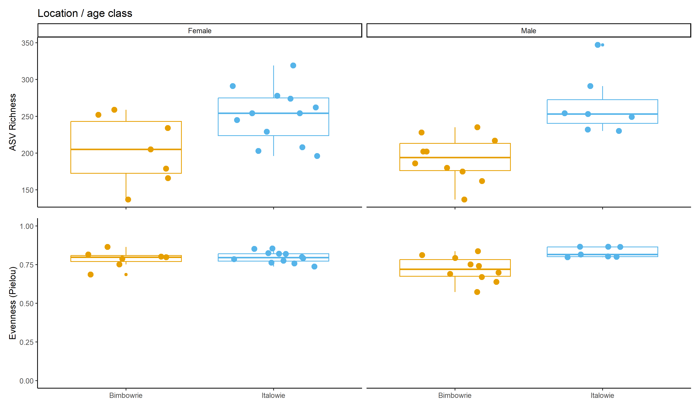

``` r
ggsave("../figures/noPY_location_sex.png", width = 10, height = 5)
```

See slightly lower microbial richness in Bimbowrie compared to Italowie.
Sex does not seem to influence faecal microbiome diversity.

### Alpha diversity (season / location)

``` r
#calculate alpha diverisites
alpha_diversity <- alpha(ps_adults, index = "all")

#edit metadata file for plotting
metadata <- meta(ps_rar)
metadata$name <- rownames(metadata)
alpha_diversity$name <- rownames(alpha_diversity)
alpha_diversity_metadata <- merge(alpha_diversity, metadata, by = "name")

#plot
a <- alpha_diversity_metadata %>%
  ggplot(aes(x = Location, y = observed, colour = Location)) +
  geom_boxplot() +
  geom_jitter(size = 3, width = 0.3, height = 0) +
  scale_colour_manual(values = colours) +
  theme_classic() +
  theme(
    axis.title.x = element_blank(),
    legend.position = "none",
    axis.text.x = element_blank(),
    ) +
  ylab("ASV Richness") +
  ggtitle("Location / age class") +
  facet_wrap(~Sampling_trip, nrow = 1)

b <- alpha_diversity_metadata %>%
  ggplot(aes(x = Location, y = evenness_pielou, colour = Location)) +
  geom_boxplot() +
  geom_jitter(size = 3, width = 0.3, height = 0) +
  scale_colour_manual(values = colours) +
  scale_y_continuous(limits = c(0, 1)) +
  theme_classic() +
  theme(
    axis.title.x = element_blank(),
    legend.position = "none",
    strip.background = element_blank(),
    strip.text = element_blank()
    ) +
  ylab("Evenness (Pielou)") +
  facet_wrap(~Sampling_trip, nrow = 1)

#use patchwork to join figures
a / b
```

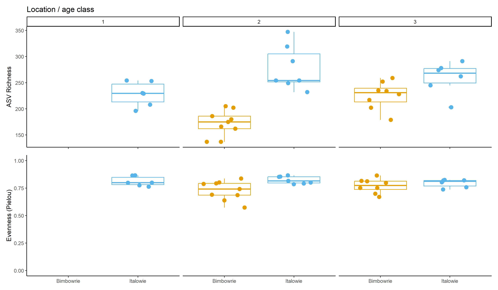

``` r
ggsave("../figures/noPY_location_trip.png", width = 10, height = 5)
```

Can see a moderate difference in ASV richness between season 2/3 for
Bimbowrie, but not for Italowie.

### Alpha diversity stats

``` r
library(lme4)

#Refactor Dam_name to numeric
alpha_diversity_metadata$individual_id <- as.numeric(factor(alpha_diversity_metadata$Dam_name, levels = unique(alpha_diversity_metadata$Dam_name)))


##First test if sex influences diversity
richness_sex <- lm(rank(observed) ~ Location + Animal_sex + (1|individual_id), data = alpha_diversity_metadata)

anova(richness_sex)
```

    Analysis of Variance Table

    Response: rank(observed)
               Df  Sum Sq Mean Sq F value    Pr(>F)    
    Location    1 1591.61 1591.61 23.0373 3.324e-05 ***
    Animal_sex  1    9.98    9.98  0.1445    0.7063    
    Residuals  33 2279.91   69.09                      
    ---
    Signif. codes:  0 '***' 0.001 '**' 0.01 '*' 0.05 '.' 0.1 ' ' 1

``` r
#Do the residuals look normally distributed?
hist(residuals(richness_sex))
```

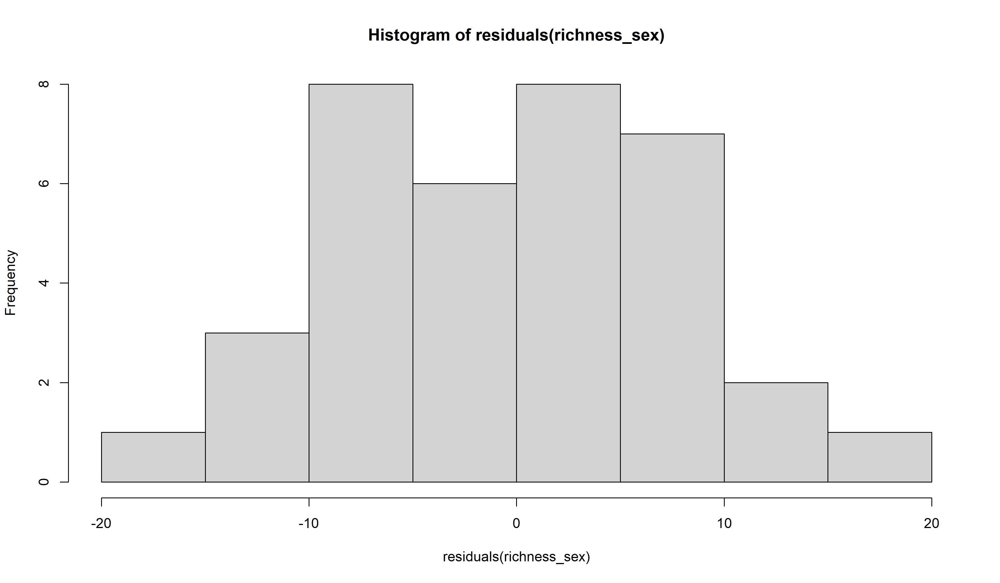

``` r
shapiro.test(residuals(richness_sex))
```


        Shapiro-Wilk normality test

    data:  residuals(richness_sex)
    W = 0.98413, p-value = 0.8736

``` r
##Linear model of diversity ~ Location + trip, treating sample as a random effect (some samples come from the same individual)
richness <- lm(rank(observed) ~ Location + Sampling_trip + Location:Sampling_trip + (1|individual_id), data = alpha_diversity_metadata)

anova(richness)
```

    Analysis of Variance Table

    Response: rank(observed)
                           Df  Sum Sq Mean Sq F value    Pr(>F)    
    Location                1 1591.61 1591.61 37.1323 9.403e-07 ***
    Sampling_trip           2  620.36  310.18  7.2366  0.002636 ** 
    Location:Sampling_trip  1  340.77  340.77  7.9503  0.008306 ** 
    Residuals              31 1328.76   42.86                      
    ---
    Signif. codes:  0 '***' 0.001 '**' 0.01 '*' 0.05 '.' 0.1 ' ' 1

``` r
#Do the residuals look normally distributed?
hist(residuals(richness))
```

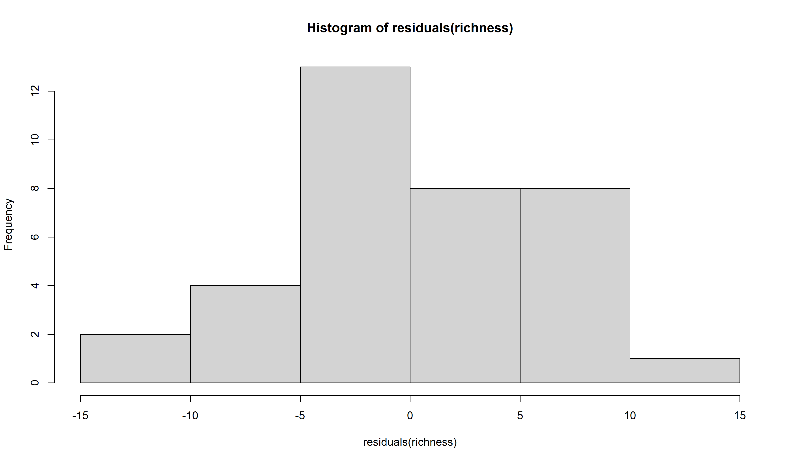

``` r
shapiro.test(residuals(richness))
```


        Shapiro-Wilk normality test

    data:  residuals(richness)
    W = 0.97316, p-value = 0.5181

``` r
#Same for evenness
evenness <- lm(rank(evenness_pielou) ~ Location + Sampling_trip + Location:Sampling_trip + (1|individual_id), data = alpha_diversity_metadata)

anova(evenness)
```

    Analysis of Variance Table

    Response: rank(evenness_pielou)
                           Df  Sum Sq Mean Sq F value Pr(>F)  
    Location                1  704.42  704.42  7.2170 0.0115 *
    Sampling_trip           2   11.46    5.73  0.0587 0.9431  
    Location:Sampling_trip  1  143.33  143.33  1.4684 0.2348  
    Residuals              31 3025.79   97.61                 
    ---
    Signif. codes:  0 '***' 0.001 '**' 0.01 '*' 0.05 '.' 0.1 ' ' 1

``` r
#Do the residuals look normally distributed?
hist(residuals(evenness))
```

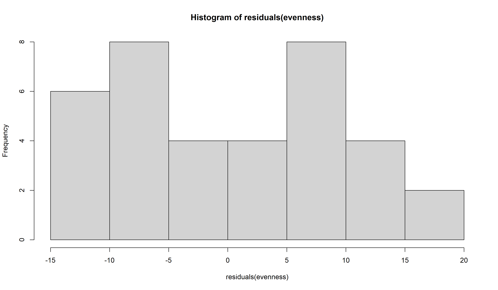

``` r
shapiro.test(residuals(evenness))
```


        Shapiro-Wilk normality test

    data:  residuals(evenness)
    W = 0.93638, p-value = 0.03923

Firstly, sex does not have a statistically significant impact on
microbial diversity (richness).

Next, using the following formula: **richness ~ Location +
Sampling_trip + (1\|individual_id)** to look at how richness is
influenced by location and sampling_trip (with individual_id as a random
factor to account for some individuals being sampled across multiple
trips).

Location seems to have the largest impact on diversity, though location,
sampling_trip, and the interaction between sampling_trip:location are
all statistically significant ( using the arbitrary cutoff of
*p*\<0.01). Residuals looks normally distributed, and the Shapiro test
suggests normality (\>0.05).

Finally, evenness (with the same formula) paints a different picture.
Only location is statistically significant, though effect size is likely
not biologically relevant, and the *p*-value is high (only 0.011).

In conclusion, sex does not have an observable influence on microbial
richness. Location (strongest), sampling_trip, and the interaction
between location/sampling trip have a statistically significant
influence on microbial richness. Microbial community evenness however,
does not seem to follow this trend.

### Beta diversity (axes 1/2)

``` r
library(vegan)

#Beta diversity
unweighted_unifrac <- ordinate(ps_adults, 
                               method = "PCoA", 
                               distance = "unifrac", weighted=F)

weighted_unifrac <- ordinate(ps_adults, 
                               method = "PCoA", 
                               distance = "unifrac", weighted=T)

#Unweighted
uw <- plot_ordination(physeq = ps_adults,
                ordination = unweighted_unifrac,
                color = "Location",
                shape = "Animal_sex",
                axes = c(1, 2)) +
  geom_point(size = 4) +
  theme_minimal() +
  scale_colour_manual(values = colours) +
  theme_classic() +
  ggtitle("A) Unweighted UniFrac") +
  theme(
    legend.position = "none",
    legend.title = element_blank()
    ) 

#Weighted
w <- plot_ordination(physeq = ps_adults,
                ordination = weighted_unifrac,
                color = "Location",
                shape = "Animal_sex",
                axes = c(1, 2)) +
  geom_point(size = 4) +
  theme_minimal() +
  scale_colour_manual(values = colours) +
  theme_classic() +
  ggtitle("B) Weighted UniFrac") +
  theme(
    legend.position = "top",
    legend.title = element_blank(),
    axis.text = element_text(size = 14),
    axis.title = element_text(size = 16),
    legend.text = element_text(size = 16),
    ) 

combined <- uw / w
combined
```

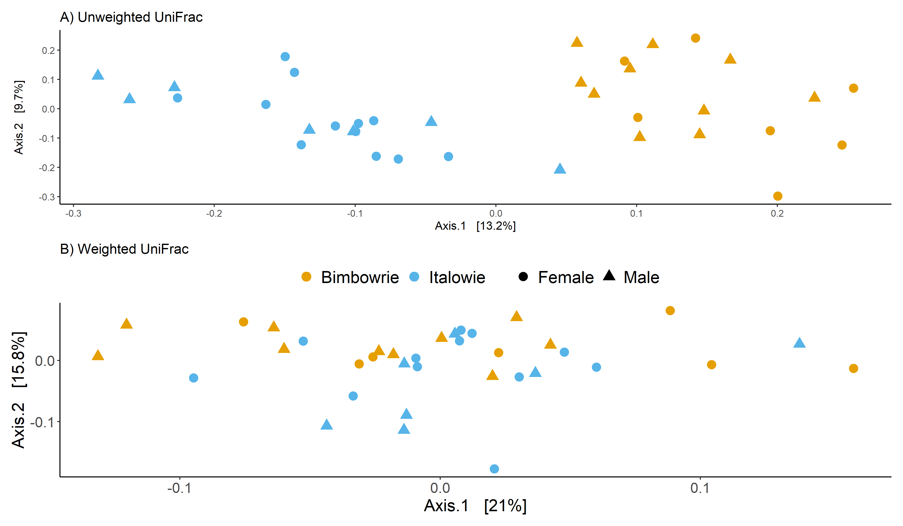

``` r
ggsave("../figures/beta_div_sex_1_2.png", plot = combined, height = 10, width = 10)


## Adonis (similar to PERMANOVA) test
#refactor metadata
md_adults <- as(sample_data(ps_adults), "data.frame")

md_adults$individual_id <- as.numeric(factor(md_adults$Dam_name, 
                                             levels = unique(md_adults$Dam_name)))

#Run adonis: location + sampling_trip + (1|individual_id) with 9999 permutations
uw_adonis <- adonis2(distance(ps_adults, method="unifrac") ~ Location + Animal_sex + Sampling_trip + (1|individual_id), data = md_adults, permutations = 9999)

uw_adonis
```

    Permutation test for adonis under reduced model
    Terms added sequentially (first to last)
    Permutation: free
    Number of permutations: 9999

    adonis2(formula = distance(ps_adults, method = "unifrac") ~ Location + Animal_sex + Sampling_trip + (1 | individual_id), data = md_adults, permutations = 9999)
                  Df SumOfSqs      R2      F Pr(>F)    
    Location       1   0.7387 0.11745 4.7187 0.0001 ***
    Animal_sex     1   0.1505 0.02394 0.9617 0.5053    
    Sampling_trip  2   0.5473 0.08702 1.7481 0.0002 ***
    Residual      31   4.8529 0.77159                  
    Total         35   6.2894 1.00000                  
    ---
    Signif. codes:  0 '***' 0.001 '**' 0.01 '*' 0.05 '.' 0.1 ' ' 1

``` r
#Check for homogenaeity multivariate dispersion with betadisper
location <- md_adults[["Location"]]
uw_disp <- betadisper(distance(ps_adults, method="unifrac"), group = location)

anova(uw_disp)
```

    Analysis of Variance Table

    Response: Distances
              Df   Sum Sq   Mean Sq F value Pr(>F)
    Groups     1 0.002642 0.0026416  1.4668 0.2342
    Residuals 34 0.061232 0.0018009               

``` r
#plots for homoegenaeity

plot(uw_disp)
```

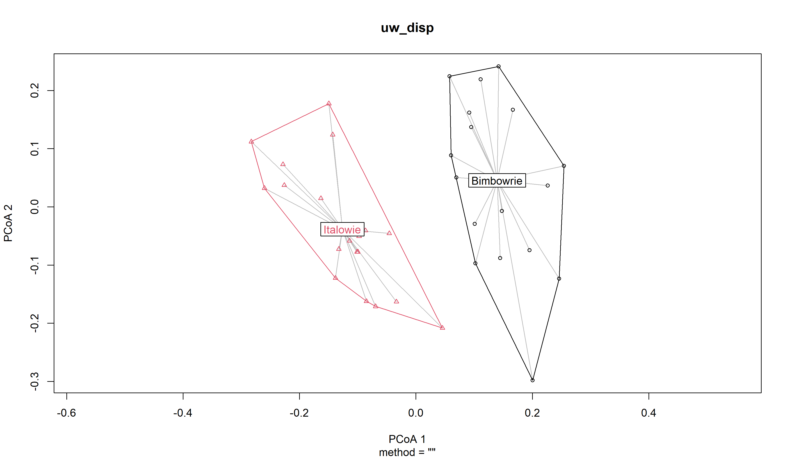

``` r
boxplot(uw_disp)
```

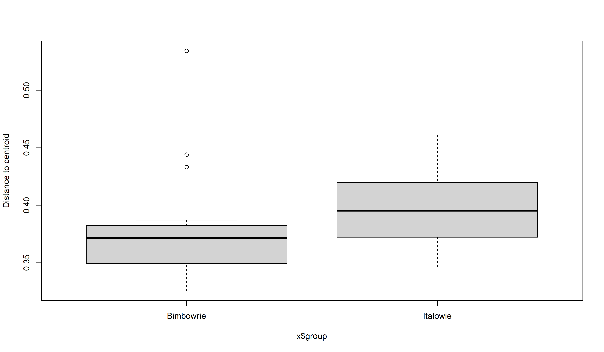

``` r
#Tukey HSD
uw_disp_HSD <- TukeyHSD(uw_disp)
plot(uw_disp_HSD)
```

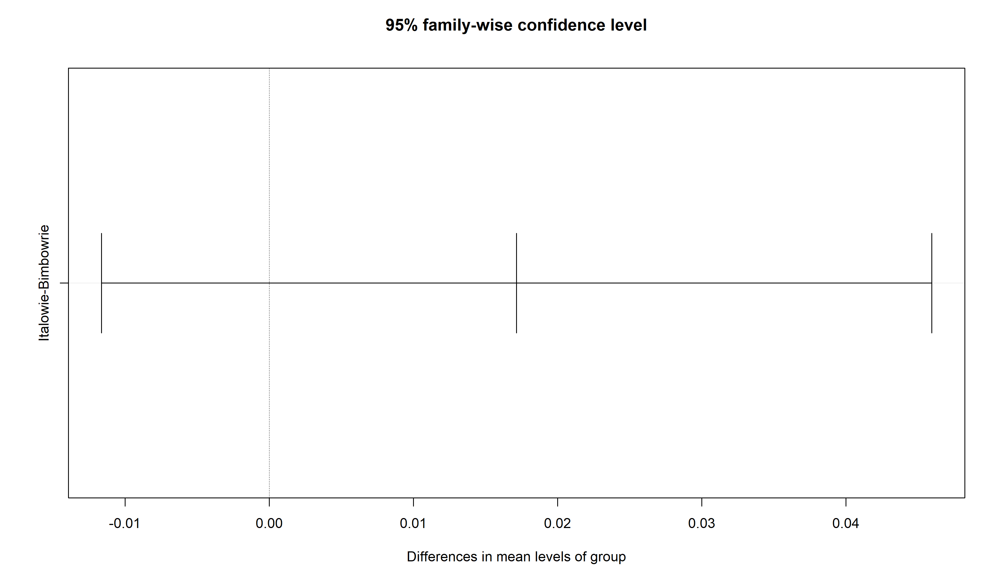

``` r
##Now same for weighted unifrac
w_adonis <- adonis2(distance(ps_adults, method="wunifrac") ~ Location + Animal_sex + Sampling_trip + (1|individual_id), data = md_adults, permutations = 9999)

w_adonis
```

    Permutation test for adonis under reduced model
    Terms added sequentially (first to last)
    Permutation: free
    Number of permutations: 9999

    adonis2(formula = distance(ps_adults, method = "wunifrac") ~ Location + Animal_sex + Sampling_trip + (1 | individual_id), data = md_adults, permutations = 9999)
                  Df SumOfSqs      R2      F Pr(>F)   
    Location       1  0.04927 0.07470 2.7777 0.0013 **
    Animal_sex     1  0.01384 0.02098 0.7801 0.6989   
    Sampling_trip  2  0.04661 0.07068 1.3141 0.1275   
    Residual      31  0.54983 0.83365                 
    Total         35  0.65955 1.00000                 
    ---
    Signif. codes:  0 '***' 0.001 '**' 0.01 '*' 0.05 '.' 0.1 ' ' 1

``` r
#Check for homogenaeity multivariate dispersion with betadisper
location <- md_adults[["Location"]]
w_disp <- betadisper(distance(ps_adults, method="wunifrac"), group = location)

anova(w_disp)
```

    Analysis of Variance Table

    Response: Distances
              Df   Sum Sq   Mean Sq F value Pr(>F)
    Groups     1 0.001860 0.0018595    1.22 0.2771
    Residuals 34 0.051821 0.0015241               

``` r
#plots for homoegenaeity

plot(w_disp)
```

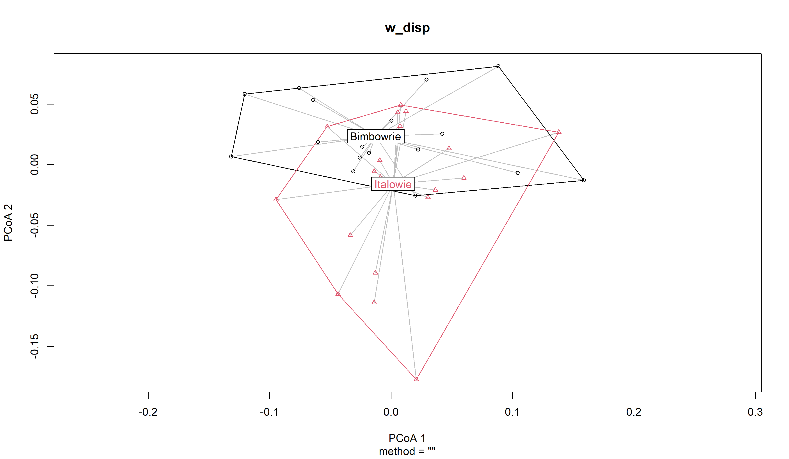

``` r
boxplot(w_disp)
```

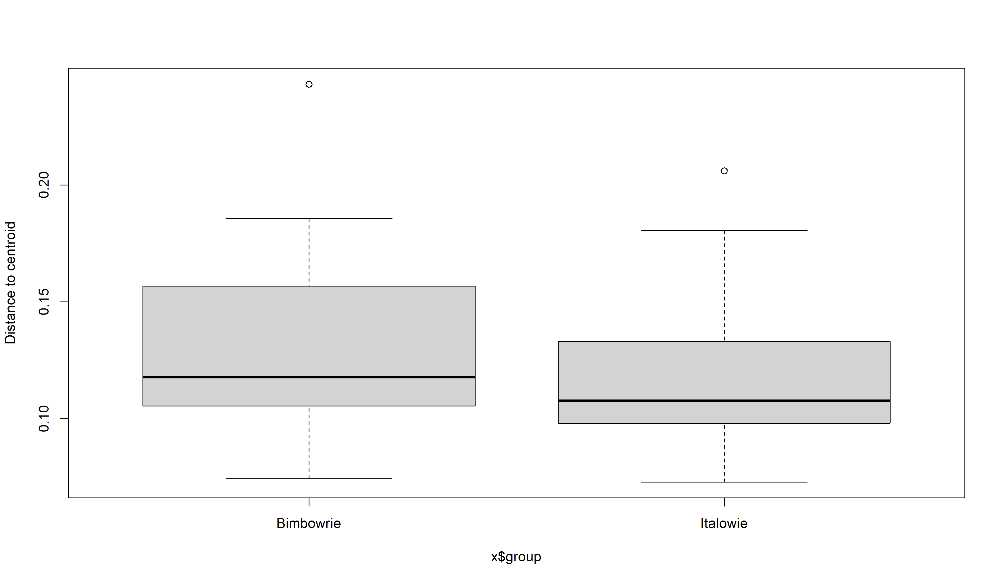

``` r
#Tukey HSD
w_disp_HSD <- TukeyHSD(w_disp)
plot(w_disp_HSD)
```

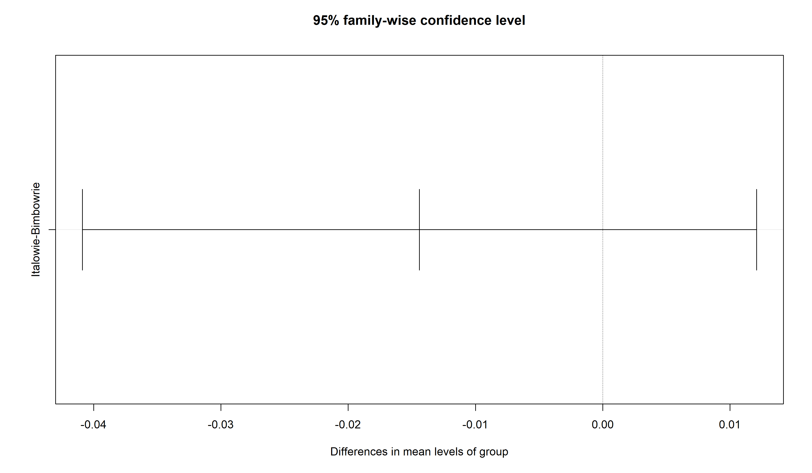

Use Adonis (PERMANOVA-like) to test for statistically significant
influences of metadata on microbial composition. I’ll use a similar
formula to the alpha diversity tests above:

`Location + Animal_sex + Sampling_trip + (1|individual_id)`

**Unweighted UniFrac  
**Again, sex has no statistically significant (observable) impact on
microbial composition. Location explains more variation (R2 = 0.117)
compared to sampling_trip (R2 = 0.087). Both are statistically
significant. Still quite a lot of residual variation (R2 = 0.77). I then
test for homogeneity of variance between groups (assumption of
PERMANOVA) using betadisper. Plots and Tukey’s HSD suggest no meaningful
variation in homogeneity between groups.

**Weighted UniFrac  
**Similar results to Unweighted UniFrac, except only location is
statistically significant, and variation explained is lower (R2 =
0.074). Assumptions regarding homogeneity also seem fine as above.

### Beta diversity (axes 1/3)

``` r
#Beta diversity
unweighted_unifrac <- ordinate(ps_adults, 
                               method = "PCoA", 
                               distance = "unifrac", weighted=F)

weighted_unifrac <- ordinate(ps_adults, 
                               method = "PCoA", 
                               distance = "unifrac", weighted=T)

#Unweighted
uw <- plot_ordination(physeq = ps_adults,
                ordination = unweighted_unifrac,
                color = "Location",
                shape = "Animal_sex",
                axes = c(1, 3)) +
  geom_point(size = 4) +
  theme_minimal() +
  scale_colour_manual(values = colours) +
  theme_classic() +
  ggtitle("A) Unweighted UniFrac") +
  theme(
    legend.position = "none",
    legend.title = element_blank()
    ) 

#Weighted
w <- plot_ordination(physeq = ps_adults,
                ordination = weighted_unifrac,
                color = "Location",
                shape = "Animal_sex",
                axes = c(1, 3)) +
  geom_point(size = 4) +
  theme_minimal() +
  scale_colour_manual(values = colours) +
  theme_classic() +
  ggtitle("B) Weighted UniFrac") +
  theme(
    legend.position = "top",
    legend.title = element_blank(),
    axis.text = element_text(size = 14),
    axis.title = element_text(size = 16),
    legend.text = element_text(size = 16),
    ) 

combined <- uw / w
combined
```

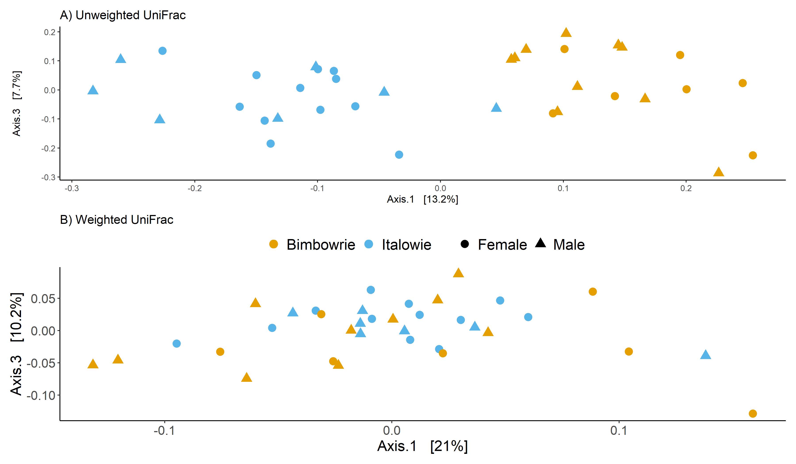

``` r
ggsave("../figures/beta_div_sex_1_3.png", plot = combined, height = 10, width = 10)
```

Likewise for axes 1/3. (Didn’t do tests here, but can if needed).

### Beta diversity (separate ordinations for locations)

Given that location seems to drive most variation, lets try splitting
the ordinations then looking at season.

``` r
#Split table
ps_bimb <- subset_samples(ps_adults, Location == "Bimbowrie")
ps_ital <- subset_samples(ps_adults, Location == "Italowie")

#Beta diversity
unweighted_unifrac <- ordinate(ps_bimb, 
                               method = "PCoA", 
                               distance = "unifrac", weighted=F)

weighted_unifrac <- ordinate(ps_bimb, 
                               method = "PCoA", 
                               distance = "unifrac", weighted=T)

#Bimbowrie
#Unweighted
uw <- plot_ordination(physeq = ps_bimb,
                ordination = unweighted_unifrac,
                color = "season",
#                shape = "Dam_with_PY",
                axes = c(1, 2)) +
  geom_point(size = 4) +
  theme_minimal() +
  scale_colour_manual(values = colours) +
  theme_classic() +
  ggtitle("A) Unweighted UniFrac") +
  theme(
    legend.position = "none",
    legend.title = element_blank()
    ) 

#Weighted
w <- plot_ordination(physeq = ps_bimb,
                ordination = weighted_unifrac,
                color = "season",
#                shape = "Dam_with_PY",
                axes = c(1, 2)) +
  geom_point(size = 4) +
  theme_minimal() +
  scale_colour_manual(values = colours) +
  theme_classic() +
  ggtitle("B) Weighted UniFrac") +
  theme(
    legend.position = "top",
    legend.title = element_blank(),
    axis.text = element_text(size = 14),
    axis.title = element_text(size = 16),
    legend.text = element_text(size = 16),
    ) 

bimb_combined <- uw / w
bimb_combined
```

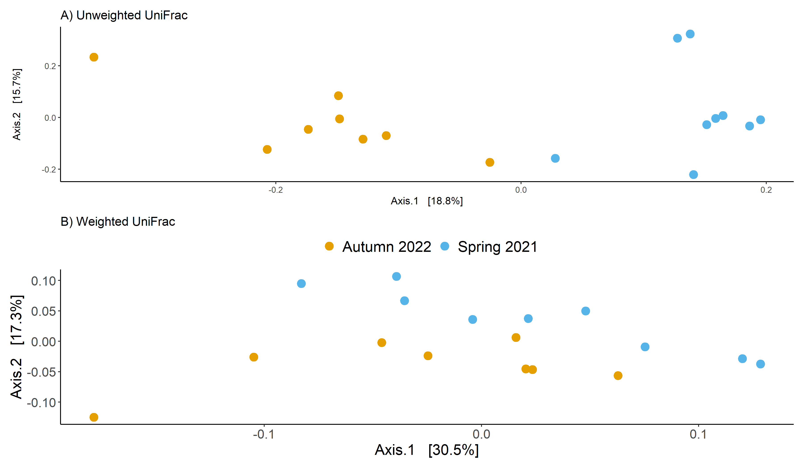

``` r
ggsave("../figures/beta_div_bimb_1_2.png", plot = bimb_combined, height = 10, width = 10)


#Italowie

unweighted_unifrac <- ordinate(ps_ital, 
                               method = "PCoA", 
                               distance = "unifrac", weighted=F)

weighted_unifrac <- ordinate(ps_ital, 
                               method = "PCoA", 
                               distance = "unifrac", weighted=T)
#Unweighted
uw <- plot_ordination(physeq = ps_ital,
                ordination = unweighted_unifrac,
                color = "season",
                axes = c(1, 2)) +
  geom_point(size = 4) +
  theme_minimal() +
  scale_colour_manual(values = colours) +
  theme_classic() +
  ggtitle("A) Unweighted UniFrac") +
  theme(
    legend.position = "none",
    legend.title = element_blank()
    ) 

#Weighted
w <- plot_ordination(physeq = ps_ital,
                ordination = weighted_unifrac,
                color = "season",
                axes = c(1, 2)) +
  geom_point(size = 4) +
  theme_minimal() +
  scale_colour_manual(values = colours) +
  theme_classic() +
  ggtitle("B) Weighted UniFrac") +
  theme(
    legend.position = "top",
    legend.title = element_blank(),
    axis.text = element_text(size = 14),
    axis.title = element_text(size = 16),
    legend.text = element_text(size = 16),
    ) 

ital_combined <- uw / w
ital_combined
```

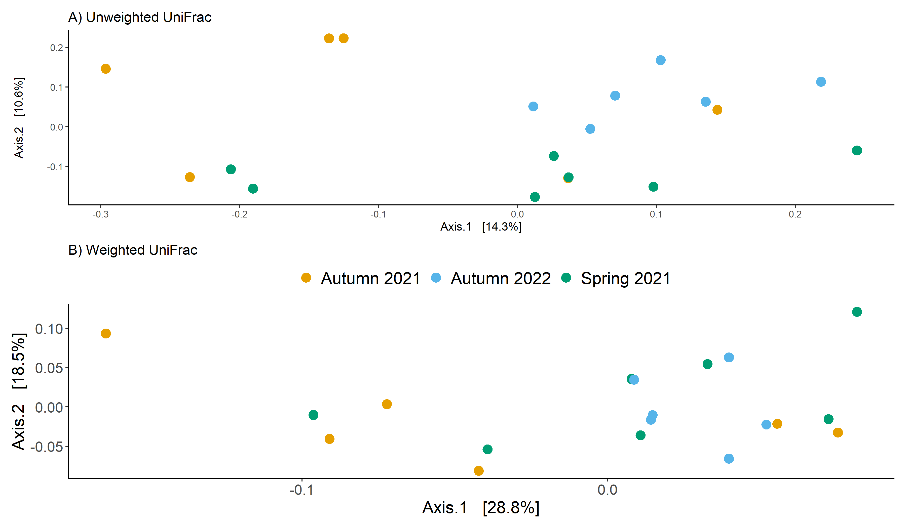

``` r
ggsave("../figures/beta_div_ital_1_2.png", plot = ital_combined, height = 10, width = 10)
```

We again see variation associated with season across axis 1 for
unweighted unifrac for Bimbowrie, but not so much for Italowie. (Didn’t
run stats for these, but can if we want to include them in the final
paper???)

### Taxa bar plots (all samples)

``` r
library(microshades)
library(ggh4x)

py_mdf <- ps_adults %>%
  tax_glom("Genus") %>%
  phyloseq::transform_sample_counts(function(x) { x/sum(x) }) %>%
  psmelt() %>%
  filter(Abundance > 0)

#get the top 6 most abundant phyla
counts <- ps_adults %>%
  tax_glom("Genus") %>%
  psmelt()
mean <- counts %>%
  group_by(Phylum) %>%
  summarise(relab = sum(Abundance))

mean
```

    # A tibble: 13 × 2
       Phylum             relab
       <chr>              <dbl>
     1 Actinobacteriota     173
     2 Bacteroidota      100866
     3 Campilobacterota    1050
     4 Cyanobacteria       3674
     5 Desulfobacterota    1972
     6 Elusimicrobiota      115
     7 Firmicutes        143738
     8 Halobacterota        365
     9 Planctomycetota      279
    10 Proteobacteria      2326
    11 Spirochaetota         52
    12 Thermoplasmatota      30
    13 Verrucomicrobiota  18376

``` r
ms_py <- create_color_dfs(py_mdf, 
                          selected_groups = c('Firmicutes',
                                              'Bacteroidota',
                                              'Verrucomicrobiota',
                                              'Cyanobacteria',
                                              'Proteobacteria'),
                          group_level = "Phylum", 
                          subgroup_level = "Genus", 
                          cvd = TRUE)


plot_microshades(ms_py$mdf, 
                 cdf = ms_py$cdf, 
                 group_label = "Phylum Genus") +
  facet_nested(~Location + Sampling_trip,
               space = "free",
               scale = "free") +
  scale_y_continuous(labels = scales::percent, 
                     expand = expansion(0)) +
  theme_classic() +
  theme(
    legend.position = "bottom",
    legend.title = element_blank(),
    axis.text.x = element_blank(),
    strip.text = element_text(size = 16, face = "bold")
  ) +
  xlab("") +
  ylab("Relative abundance (%)")
```

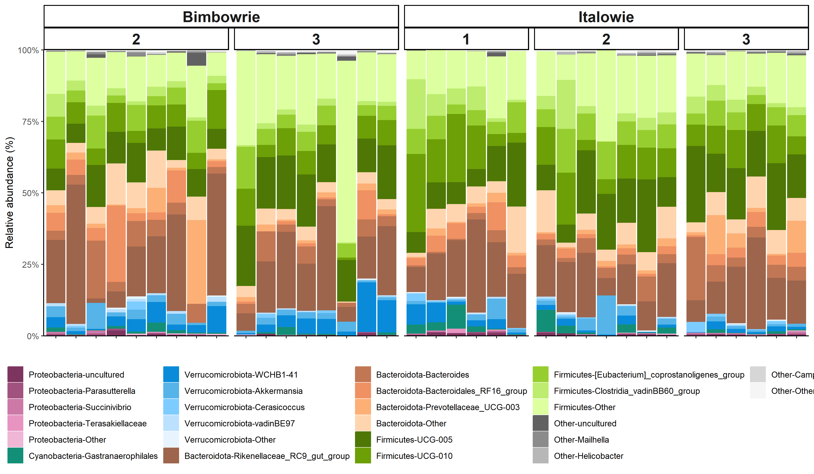

Nothing really jumps out here.

### Taxa bar subset of samples

``` r
library(microshades)
library(ggh4x)

sampleset1 <- c("Patrick", "Peter", "Polly", "Pumpkin",
                "Petra", "Pickle", "Pedro")

ps_subset1 <- subset_samples(ps_adults, 
                             Dam_name %in% sampleset1)
ps_subset1 <- subset_samples(ps_subset1, 
                             sample_name != "35-21FBIMB3rd")
ps_subset1 <- subset_samples(ps_subset1, 
                             sample_name != "42-21FBIMB2nd")


py_mdf <- ps_subset1 %>%
  tax_glom("Genus") %>%
  phyloseq::transform_sample_counts(function(x) { x/sum(x) }) %>%
  psmelt() %>%
  filter(Abundance > 0)

#get the top 6 most abundant phyla
counts <- ps_subset1 %>%
  tax_glom("Genus") %>%
  psmelt()
mean <- counts %>%
  group_by(Phylum) %>%
  summarise(relab = sum(Abundance))

mean
```

    # A tibble: 13 × 2
       Phylum            relab
       <chr>             <dbl>
     1 Actinobacteriota    118
     2 Bacteroidota      24609
     3 Campilobacterota    197
     4 Cyanobacteria       354
     5 Desulfobacterota    475
     6 Elusimicrobiota       0
     7 Firmicutes        30343
     8 Halobacterota        70
     9 Planctomycetota     124
    10 Proteobacteria      306
    11 Spirochaetota         0
    12 Thermoplasmatota      0
    13 Verrucomicrobiota  4545

``` r
ms_py <- create_color_dfs(py_mdf, 
                          selected_groups = c('Firmicutes',
                                              'Bacteroidota',
                                              'Verrucomicrobiota',
                                              'Cyanobacteria',
                                              'Proteobacteria'),
                          group_level = "Phylum", 
                          subgroup_level = "Genus", 
                          cvd = TRUE)

#reorder factors
ms_py$mdf$season <- factor(ms_py$mdf$season,
                           levels = c("Spring 2021", "Autumn 2022"))

plot_microshades(ms_py$mdf, 
                 cdf = ms_py$cdf, 
                 group_label = "Phylum Genus",
                 x = "Dam_name") +
  facet_nested(~season,
               space = "free",
               scale = "free", ) +
  scale_y_continuous(labels = scales::percent, 
                     expand = expansion(0)) +
  theme_classic() +
  theme(
    legend.position = "bottom",
    legend.title = element_blank(),
    legend.text = element_text(size = 12),
    axis.text.x = element_text(angle = 90, size = 14, face = "bold"),
    strip.text = element_text(size = 16, face = "bold")
  ) +
  xlab("") +
  ylab("Relative abundance (%)")
```

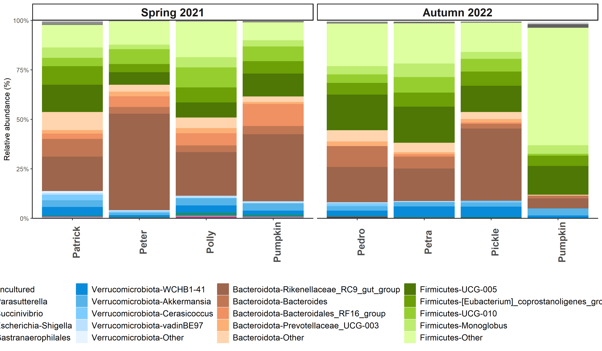

### Taxa bar subset of samples (2)

``` r
library(microshades)
library(ggh4x)

sampleset2 <- c("Judd", "Zara", "Eileen", "Elton",
                "Max", "Lola", "Meatloaf", "Rosie",
                "Tags", "Valerie", "Adele", "Brandy",
                "Cecilia")

ps_subset2 <- subset_samples(ps_adults, 
                             Dam_name %in% sampleset2)
ps_subset2 <- subset_samples(ps_subset2, 
                             sample_name != "2-21FITA1st")


py_mdf <- ps_subset2 %>%
  tax_glom("Genus") %>%
  phyloseq::transform_sample_counts(function(x) { x/sum(x) }) %>%
  psmelt() %>%
  filter(Abundance > 0)

#get the top 6 most abundant phyla
counts <- ps_subset2 %>%
  tax_glom("Genus") %>%
  psmelt()
mean <- counts %>%
  group_by(Phylum) %>%
  summarise(relab = sum(Abundance))

ms_py <- create_color_dfs(py_mdf, 
                          selected_groups = c('Firmicutes',
                                              'Bacteroidota',
                                              'Verrucomicrobiota',
                                              'Cyanobacteria',
                                              'Proteobacteria'),
                          group_level = "Phylum", 
                          subgroup_level = "Genus", 
                          cvd = TRUE)

#reorder factors
ms_py$mdf$season <- factor(ms_py$mdf$season,
                           levels = c("Autumn 2021", "Spring 2021", "Autumn 2022"))

plot_microshades(ms_py$mdf, 
                 cdf = ms_py$cdf, 
                 group_label = "Phylum Genus",
                 x = "Dam_name") +
  facet_nested(~season,
               space = "free",
               scale = "free", ) +
  scale_y_continuous(labels = scales::percent, 
                     expand = expansion(0)) +
  theme_classic() +
  theme(
    legend.position = "bottom",
    legend.title = element_blank(),
    legend.text = element_text(size = 12),
    axis.text.x = element_text(angle = 90, size = 14, face = "bold"),
    strip.text = element_text(size = 16, face = "bold")
  ) +
  xlab("") +
  ylab("Relative abundance (%)")
```

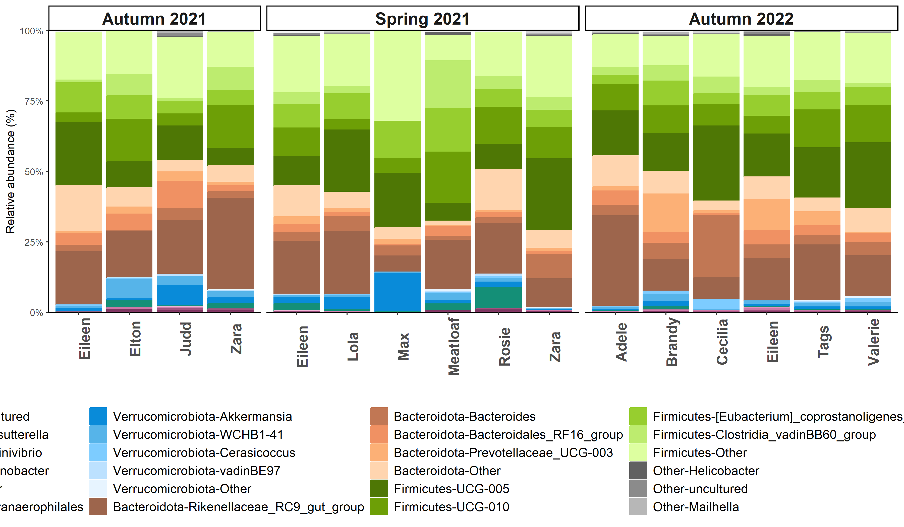

### Differential abundance with ANCOMBC-2

``` r
# library(ANCOMBC)
# 
# ps_adults_glom <- ps_adults %>%
#   tax_glom("Genus")
# 
# #Run ancombc2: Location & season as fixed effects, individual as random effect
# # ancombc2_location <- ancombc2(data = ps_adults,
# #                               assay_name = "counts",
# #                               tax_level = "Genus",
# #                               fix_formula = "Location + season",
# #                               rand_formula = "(1 | Dam_name)",
# #                               lib_cut = 6000,
# #                               n_cl = 4)
# 
# 
# #save output
# saveRDS(ancombc2_location, "../data/ancombc_location_season_individual.rds")
# saveRDS(ancombc2_location_asv, "../data/ancombc2_location_season_asv.rds")
# 
# #Split table by location, then run testing for season
# 
# ps_bimba <- subset_samples(ps_adults, Location == "Bimbowrie")
# ps_italo <- subset_samples(ps_adults, Location == "Italowie")
# 
# ps_bimba_glom <- ps_bimba %>%
#   tax_glom("Genus")
# ps_italo_glom <- ps_italo %>%
#   tax_glom("Genus")
# 
# # ancombc2_bimba_season_asv <- ancombc2(data = ps_bimba,
# #                               assay_name = "counts",
# # #                              tax_level = "Genus",
# #                               fix_formula = "season",
# #                               rand_formula = "(1 | Dam_name)",
# #                               lme_control = lme4::lmerControl(),
# #                               lib_cut = 6000,
# #                               n_cl = 4)
# # 
# # 
# # saveRDS(ancombc2_bimba_season_glom, "../data/ancombc2_bimba_season_glom.rds")
# # 
# # 
# # ancombc2_italo_season <- ancombc2(data = ps_italo,
# #                               assay_name = "counts",
# # #                              tax_level = "Genus",
# #                               fix_formula = "season",
# # #                              rand_formula = "(1 | Dam_name)",
# #                               lme_control = lme4::lmerControl(),
# #                               lib_cut = 6000,
# #                               n_cl = 4)
# # 
# # 
# # saveRDS(ancombc2_italo_season, "../data/ancombc2_italo_season_glom.rds")
# 
# 
# 
# bimb_season <- readRDS("../data/ancombc2_bimba_season.rds")
# 
# ital_season <- readRDS("../data/ancombc2_italo_season.rds")
# 
# ancom_all <- ancombc2_location$res
# ancom_all_glom <- ancombc2_location_glom$res
# ancom_bimb <- ancombc2_bimba_season$res
# ancom_bimb_glom <- ancombc2_bimba_season_glom$res
# ancom_ital_glom <- ancombc2_italo_season$res
# ancom_bimb_asv <- ancombc2_bimba_season_asv$res
# ancom_all_asv <- ancombc2_location_asv$res
```

### Venn diagrams of ASVs

``` r
library(VennDiagram)
```

    Loading required package: grid

    Loading required package: futile.logger

``` r
library(ggVennDiagram)
```


    Attaching package: 'ggVennDiagram'

    The following object is masked from 'package:microbiome':

        overlap

    The following object is masked from 'package:tidyr':

        unite

``` r
ps_bimba <- subset_samples(ps_adults, Location == "Bimbowrie")
ps_italo <- subset_samples(ps_adults, Location == "Italowie")

ps_bimba_table <- otu_table(ps_bimba)
ps_italo_table <- otu_table(ps_italo)

ps_merged <- merge_phyloseq(ps_bimba, ps_italo)
ps_merged_filt <- prune_taxa(taxa_sums(ps_merged) > 0, ps_merged)

#For each ASV (row), if abundance > 2, print ASV (rowname) to a vector
venn_bimba <- rownames(ps_bimba_table[ apply(ps_bimba_table, MARGIN = 1,
                                             function(x) any(x > 2))])

venn_italo <- rownames(ps_italo_table[ apply(ps_italo_table, MARGIN = 1,
                                                  function(x) any(x > 2))])


venn_both <- list(Bimbowrie = venn_bimba, 
                  Italowie = venn_italo)


VennDiagram::venn.diagram(venn_both, 
                          fill = c("#E69F00", "#56B4E9"),
                          disable.logging = TRUE,
                          alpha = 0.5,
                          filename = "../figures/venn.png",
                          print.mode = c("raw","percent"))
```

    INFO [2024-03-14 15:48:21] [[1]]
    INFO [2024-03-14 15:48:21] venn_both
    INFO [2024-03-14 15:48:21] 
    INFO [2024-03-14 15:48:21] $fill
    INFO [2024-03-14 15:48:21] c("#E69F00", "#56B4E9")
    INFO [2024-03-14 15:48:21] 
    INFO [2024-03-14 15:48:21] $disable.logging
    INFO [2024-03-14 15:48:21] [1] TRUE
    INFO [2024-03-14 15:48:21] 
    INFO [2024-03-14 15:48:21] $alpha
    INFO [2024-03-14 15:48:21] [1] 0.5
    INFO [2024-03-14 15:48:21] 
    INFO [2024-03-14 15:48:21] $filename
    INFO [2024-03-14 15:48:21] [1] "../figures/venn.png"
    INFO [2024-03-14 15:48:21] 
    INFO [2024-03-14 15:48:21] $print.mode
    INFO [2024-03-14 15:48:21] c("raw", "percent")
    INFO [2024-03-14 15:48:21] 

    [1] 1

``` r
##Now, let's pull out stats about the venn diagrams (i.e. what % of ASVs and rel ab.)
#Pull out ASVs belonging to specific regions venn diagram
venn <- Venn(venn_both)
venny <- process_data(venn, shape_id = "201")
venny_df <- as_tibble(venn_region(venny))

bimba_asvs <- venny_df %>%
  filter(id == 1) %>%
  pull(item) %>%
  pluck(1)

italo_asvs <- venny_df %>%
  filter(id == 2) %>%
  pull(item) %>%
  pluck(1)

both_asvs <- venny_df %>%
  filter(id == "1/2") %>%
  pull(item) %>%
  pluck(1)

##What's the relative abundance of site-specific ASVs in each region?
#Calculated as: number of reads for site-specific ASVs / number of reads for all ASVs at site

#Bimba
percent_bimba_asv <- scales::percent(
  mean(sample_sums(prune_taxa(bimba_asvs, ps_bimba)))/
  mean(sample_sums(ps_bimba))
)
#Italo
percent_italo_asv <- scales::percent(
  mean(sample_sums(prune_taxa(italo_asvs, ps_italo)))/
  mean(sample_sums(ps_italo))
)
#Both
percent_both_asv <- scales::percent(
  mean(sample_sums(prune_taxa(both_asvs, ps_adults)))/
  mean(sample_sums(ps_adults))
)
```

Mean relative abundance of Bimbowrie-specific ASVs = 9%Mean relative
abundance of Italowie-specific ASVs = 31%Mean relative abundance of ASVs
found in both populations= 80%
